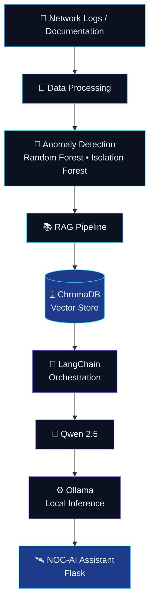
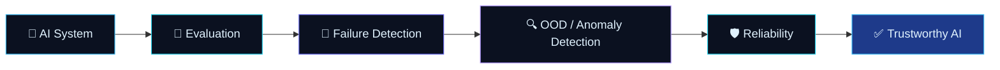
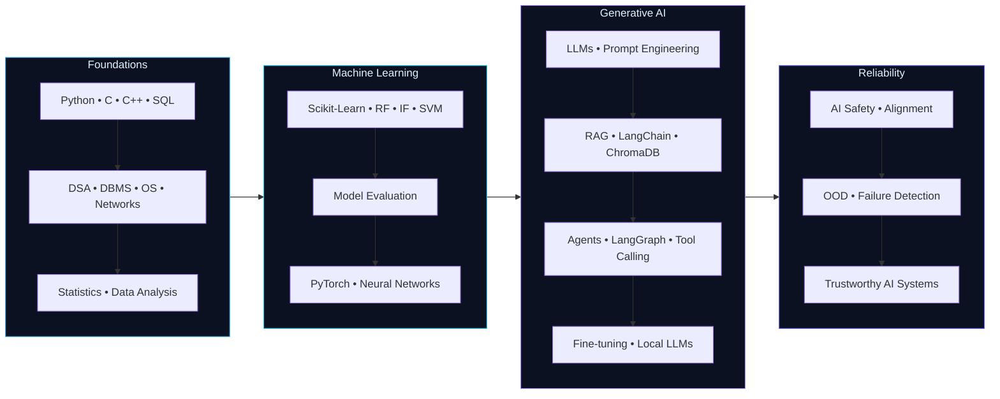

<!-- ═══════════════════════════ HERO HEADER ═══════════════════════════ -->
<div align="center">
  
</div>

<!-- ═══════════════════════════ TYPING TEXT ═══════════════════════════ -->
<div align="center">
  <a href="https://github.com/chunnilaldhakad">
    
  </a>
</div>

<!-- ═══════════════════════════ BADGES ═══════════════════════════ -->
<div align="center">

  
  <a href="https://github.com/chunnilaldhakad?tab=followers">
    
  </a>
  <a href="https://github.com/chunnilaldhakad?tab=repositories">
    
  </a>

  <br/><br/>

  
  
  
  
  

</div>

<br/>

<div align="center">
  
</div>

<!-- ═══════════════════════════ ABOUT ME ═══════════════════════════ -->
## 🧠 About Me

<table>
<tr>
<td width="62%" valign="top">

I'm **Chunnilal Dhakad**, a Computer Science undergraduate and **AI Engineer in the making**. I'm building practical AI systems while learning the fundamentals deeply — from classical machine learning to Large Language Models, Retrieval-Augmented Generation, and agentic workflows.

- 🔭 **Building** offline / air-gapped AI assistants, RAG pipelines, and AI-powered applications
- 🤖 **Working with** LLMs, LangChain, LangGraph, ChromaDB, Ollama, and PyTorch
- 🔬 **Exploring** AI safety, alignment, model evaluation, and failure-mode detection
- 🎓 **Learning** the full AI engineering stack — data → models → deployment → reliability
- 🌱 Currently an **AI Intern at LinuxWorld Informatics Pvt. Ltd.**
- 🇮🇳 Interested in AI that works in **Hindi / Hinglish** and low-resource, offline environments

</td>
<td width="38%" valign="top">

```yaml
name: Chunnilal Dhakad
role: AI Engineer (in the making)
education: B.Tech CSE, RCERT Jaipur (RTU)
graduation: 2028 (expected)
internship: AI Intern @ LinuxWorld

focus:
  - Generative AI & LLMs
  - RAG & Agentic AI
  - Local / Offline AI
  - AI Reliability & Safety

languages: [Python, C, C++, SQL]
mindset: build → evaluate → improve
```

</td>
</tr>
</table>

<!-- ═══════════════════════════ CURRENT FOCUS ═══════════════════════════ -->
## 🎯 Current Focus

<div align="center">

| 🧩 Area | 🚀 What I'm Doing |
|:--|:--|
| **Generative AI & LLMs** | Working with open and hosted LLMs, prompt engineering, and exploring fine-tuning |
| **RAG Systems** | Building grounded pipelines with LangChain, ChromaDB, and document retrieval |
| **Agentic AI** | Experimenting with LangGraph, tool calling, and multi-step agent workflows |
| **Local / Offline AI** | Running Qwen models with Ollama in air-gapped environments |
| **AI Reliability** | Learning model evaluation, OOD / anomaly detection, and failure-mode analysis |
| **Machine Learning** | Applying Random Forest, Isolation Forest, and SVMs to real-world data |

</div>

<!-- ═══════════════════════════ TERMINAL STATUS ═══════════════════════════ -->
## 💻 AI Status Terminal

```bash
chunnilal@ai-lab:~$ ./status.sh

[ SYSTEM  ]  AI Engineer in the Making ..................... ONLINE
[ MODE    ]  build → evaluate → improve ..................... ACTIVE
[ STACK   ]  Python • PyTorch • LangChain • LangGraph • Ollama
[ FOCUS   ]  LLMs • RAG • Agentic AI • Local AI • AI Reliability
[ MODELS  ]  Qwen 2.5 (local via Ollama) • Gemini API
[ VECTOR  ]  ChromaDB .............................. connected
[ RESEARCH]  AI Safety • Alignment • OOD Detection ... exploring
[ STATUS  ]  Learning continuously .................. 100% ███████████

chunnilal@ai-lab:~$ echo "Building reliable, grounded, and useful AI."
Building reliable, grounded, and useful AI.
```

<div align="center">
  
</div>

<!-- ═══════════════════════════ SKILLS ═══════════════════════════ -->
## 🛠️ Skills & Technologies

> Official logos are used for real technologies. Conceptual skills (LLMs, RAG, AI Safety, etc.) use clean, generic icons — never fake "official" logos.

### 👨‍💻 Programming

<div align="center">
<table>
  <tr>
    <td align="center" width="120"><br/><sub><b>Python</b></sub></td>
    <td align="center" width="120"><br/><sub><b>C</b></sub></td>
    <td align="center" width="120"><br/><sub><b>C++</b></sub></td>
    <td align="center" width="120"><br/><sub><b>SQL</b></sub></td>
  </tr>
</table>
</div>

### 📊 Data Science

<div align="center">
<table>
  <tr>
    <td align="center" width="120"><br/><sub><b>NumPy</b></sub></td>
    <td align="center" width="120"><br/><sub><b>Pandas</b></sub></td>
    <td align="center" width="120"><br/><sub><b>Matplotlib</b></sub></td>
    <td align="center" width="120"><br/><sub><b>Seaborn</b></sub></td>
    <td align="center" width="120"><br/><sub><b>Statistics</b></sub></td>
    <td align="center" width="120"><br/><sub><b>Data Analysis</b></sub></td>
  </tr>
</table>
</div>

### 🤖 Machine Learning

<div align="center">
<table>
  <tr>
    <td align="center" width="120"><br/><sub><b>Machine Learning</b></sub></td>
    <td align="center" width="120"><br/><sub><b>Scikit-Learn</b></sub></td>
    <td align="center" width="120"><br/><sub><b>Random Forest</b></sub></td>
    <td align="center" width="120"><br/><sub><b>Isolation Forest</b></sub></td>
  </tr>
  <tr>
    <td align="center" width="120"><br/><sub><b>SVM</b></sub></td>
    <td align="center" width="120"><br/><sub><b>Anomaly Detection</b></sub></td>
    <td align="center" width="120"><br/><sub><b>Pattern Detection</b></sub></td>
    <td align="center" width="120"><br/><sub><b>Model Evaluation</b></sub></td>
  </tr>
</table>
</div>

### 🧬 Deep Learning

<div align="center">
<table>
  <tr>
    <td align="center" width="120"><br/><sub><b>Deep Learning</b></sub></td>
    <td align="center" width="120"><br/><sub><b>PyTorch</b></sub></td>
    <td align="center" width="120"><br/><sub><b>Neural Networks</b></sub></td>
    <td align="center" width="120"><br/><sub><b>NLP Fundamentals</b></sub></td>
  </tr>
</table>
</div>

### ✨ Generative AI

<div align="center">
<table>
  <tr>
    <td align="center" width="120"><br/><sub><b>Generative AI</b></sub></td>
    <td align="center" width="120"><br/><sub><b>LLMs</b></sub></td>
    <td align="center" width="120"><br/><sub><b>Prompt Engineering</b></sub></td>
    <td align="center" width="120"><br/><sub><b>Fine-tuning</b></sub></td>
    <td align="center" width="120"><br/><sub><b>NLP</b></sub></td>
    <td align="center" width="120"><br/><sub><b>AI Assistants</b></sub></td>
  </tr>
</table>
</div>

### 📚 RAG — Retrieval-Augmented Generation

<div align="center">
<table>
  <tr>
    <td align="center" width="120"><br/><sub><b>RAG</b></sub></td>
    <td align="center" width="120"><br/><sub><b>LangChain</b></sub></td>
    <td align="center" width="120"><br/><sub><b>ChromaDB</b></sub></td>
    <td align="center" width="120"><br/><sub><b>Vector Databases</b></sub></td>
  </tr>
  <tr>
    <td align="center" width="120"><br/><sub><b>Document Retrieval</b></sub></td>
    <td align="center" width="120"><br/><sub><b>Knowledge Retrieval</b></sub></td>
    <td align="center" width="120"><br/><sub><b>Grounded AI</b></sub></td>
    <td align="center" width="120"><br/><sub><b>Retrieval Pipelines</b></sub></td>
  </tr>
</table>
</div>

### 🕸️ Agentic AI

<div align="center">
<table>
  <tr>
    <td align="center" width="120"><br/><sub><b>AI Agents</b></sub></td>
    <td align="center" width="120"><br/><sub><b>Agentic AI</b></sub></td>
    <td align="center" width="120"><br/><sub><b>LangGraph</b></sub></td>
    <td align="center" width="120"><br/><sub><b>Agent Workflows</b></sub></td>
  </tr>
  <tr>
    <td align="center" width="120"><br/><sub><b>Tool Calling</b></sub></td>
    <td align="center" width="120"><br/><sub><b>Multi-step Workflows</b></sub></td>
    <td align="center" width="120"><br/><sub><b>Google ADK</b></sub></td>
    <td align="center" width="120"></td>
  </tr>
</table>
</div>

### 🔌 Local / Offline AI

<div align="center">
<table>
  <tr>
    <td align="center" width="120"><br/><sub><b>Ollama</b></sub></td>
    <td align="center" width="120"><br/><sub><b>Qwen</b></sub></td>
    <td align="center" width="120"><br/><sub><b>Local LLMs</b></sub></td>
    <td align="center" width="120"><br/><sub><b>Offline AI</b></sub></td>
    <td align="center" width="120"><br/><sub><b>Air-Gapped AI</b></sub></td>
    <td align="center" width="120"><br/><sub><b>Local Inference</b></sub></td>
  </tr>
</table>
</div>

### 🛡️ AI Reliability & Research

<div align="center">
<table>
  <tr>
    <td align="center" width="120"><br/><sub><b>Model Evaluation</b></sub></td>
    <td align="center" width="120"><br/><sub><b>AI Safety</b></sub></td>
    <td align="center" width="120"><br/><sub><b>AI Alignment</b></sub></td>
    <td align="center" width="120"><br/><sub><b>Reliable AI</b></sub></td>
    <td align="center" width="120"><br/><sub><b>Trustworthy AI</b></sub></td>
  </tr>
  <tr>
    <td align="center" width="120"><br/><sub><b>Failure Detection</b></sub></td>
    <td align="center" width="120"><br/><sub><b>Failure Mode Analysis</b></sub></td>
    <td align="center" width="120"><br/><sub><b>OOD Detection</b></sub></td>
    <td align="center" width="120"><br/><sub><b>Anomaly Detection</b></sub></td>
    <td align="center" width="120"><br/><sub><b>RAG Reliability</b></sub></td>
  </tr>
</table>
</div>

### ⚙️ Backend & Infrastructure

<div align="center">
<table>
  <tr>
    <td align="center" width="120"><br/><sub><b>Flask</b></sub></td>
    <td align="center" width="120"><br/><sub><b>Docker</b></sub></td>
    <td align="center" width="120"><br/><sub><b>Git</b></sub></td>
    <td align="center" width="120"><br/><sub><b>GitHub</b></sub></td>
    <td align="center" width="120"><br/><sub><b>Linux</b></sub></td>
    <td align="center" width="120"><br/><sub><b>Flutter</b></sub></td>
  </tr>
</table>
</div>

### 🧮 Computer Science Fundamentals

<div align="center">
<table>
  <tr>
    <td align="center" width="120"><br/><sub><b>Data Structures</b></sub></td>
    <td align="center" width="120"><br/><sub><b>Algorithms</b></sub></td>
    <td align="center" width="120"><br/><sub><b>DSA</b></sub></td>
    <td align="center" width="120"><br/><sub><b>DBMS</b></sub></td>
    <td align="center" width="120"><br/><sub><b>Operating Systems</b></sub></td>
    <td align="center" width="120"><br/><sub><b>Computer Networks</b></sub></td>
  </tr>
</table>
</div>

<!-- ═══════════════════════════ AI TOOLS ═══════════════════════════ -->
## 🧰 AI Tools & Assistants I Explore

> These are AI tools and assistants I use and experiment with — not programming skills.

<div align="center">
<table>
  <tr>
    <td align="center" width="130"><br/><sub><b>Claude</b></sub></td>
    <td align="center" width="130"><br/><sub><b>Gemini</b></sub></td>
    <td align="center" width="130"><br/><sub><b>Grok</b></sub></td>
    <td align="center" width="130"><br/><sub><b>Codex</b></sub></td>
    <td align="center" width="130"><br/><sub><b>Hermes</b></sub></td>
  </tr>
</table>
</div>

<div align="center">
  
</div>

<!-- ═══════════════════════════ PROJECTS ═══════════════════════════ -->
## 🚀 Featured Projects

### 🛰️ NOC-AI — Air-Gapped Predictive Co-Pilot

<a href="https://github.com/chunnilaldhakad/air-gapped-noc-offline-ai-assistant">
  
</a>

An **offline, air-gapped AI assistant** for Network Operations Centers. It analyzes network logs, detects anomalies with classical ML, and answers operator questions using a **local RAG pipeline** — no internet, no external APIs.

<p>
  
  
  
  
  
  
  
  
</p>

- 🔒 **Air-gapped architecture** — fully offline inference with Qwen 2.5 via Ollama
- 📡 **Network log analysis** — preprocessing and feature extraction from NOC logs
- 🚨 **Anomaly detection** — Random Forest + Isolation Forest for failure and outlier detection
- 📚 **Technical documentation retrieval** — grounded answers from local docs via ChromaDB + LangChain
- 🌐 **Flask** service layer for the assistant interface

<details open>
<summary><b>🏗️ Architecture</b></summary>



</details>

---

### 🏥 ClinicQueue Pro

A clinic queue and appointment system that combines **AI-based wait-time prediction** with digital token management, built for Indian clinics with **Hindi / Hinglish support**.

<p>
  
  
  
  
  
  
  
</p>

- ⏱️ **AI wait-time prediction** for patients in the queue
- 🎟️ **Digital token management** replacing paper-based queues
- 🔐 **OTP authentication** and **SMS notifications**
- 📱 **QR-based appointment verification**
- 🇮🇳 **Hindi / Hinglish** language support
- 🐳 **Dockerized architecture** for consistent deployment

---

### 🗣️ Dhakad AI

A **bilingual (Hindi + English) generative AI assistant** built with the Gemini API, streaming responses, and a modular architecture designed to grow into an agentic system.

<p>
  
  
  
  
  
  
</p>

- 🌏 **Hindi + English** conversational support
- ⚡ **Streaming responses** for a real-time chat experience
- 🧩 **Prompt engineering** and **intelligent search**
- 📱 **Flutter** front-end with a **modular AI architecture**
- 🔮 Designed for **future AI agent integration**

---

### 🪐 Exoplanet Detection System

A machine learning pipeline for detecting exoplanet candidates in **astronomical datasets** through preprocessing, pattern detection, and statistical analysis.

<p>
  
  
  
  
  
</p>

- 🔭 Works with **astronomical datasets**
- 🧹 **Data preprocessing** and feature engineering
- 🤖 **Machine learning** models for candidate classification
- 📈 **Pattern detection** and **statistical analysis** of light-curve signals

<div align="center">
  
</div>

<!-- ═══════════════════════════ EXPERIENCE ═══════════════════════════ -->
## 💼 Experience

<table>
<tr>
<td width="72" align="center" valign="top">
  
</td>
<td valign="top">

**AI Intern** — *LinuxWorld Informatics Pvt. Ltd.*
<br/>📅 June 2026 – Present

Gaining hands-on exposure to:

`Artificial Intelligence` · `Machine Learning` · `Generative AI` · `LLMs` · `Prompt Engineering` · `AI Agents` · `Practical AI Development`

</td>
</tr>
</table>

<!-- ═══════════════════════════ EDUCATION ═══════════════════════════ -->
## 🎓 Education

<table>
<tr>
<td width="72" align="center" valign="top">
  
</td>
<td valign="top">

**B.Tech — Computer Science & Engineering**
<br/>🏫 RCERT, Jaipur — *Rajasthan Technical University*
<br/>📅 Expected Graduation: **2028**

</td>
</tr>
</table>

<!-- ═══════════════════════════ ACHIEVEMENTS ═══════════════════════════ -->
## 🏆 Achievements & Participation

<div align="center">

| 🗓️ | Event / Program |
|:--:|:--|
| 🛰️ | **ISRO Hackathon 2026** — Participant |
| 🧠 | **Meta Mind Hackathon 2025** — Participant |
| 💡 | **India Is Innovating 2K26** — Participant |
| 📄 | **CSTT Research Paper Presentation** — Presenter |
| 🤝 | **PromptWars Jaipur** — Volunteer |
| 📊 | **Data Analyst with AI Training Program** — CodeSpazio Solutions |
| 🐧 | **AI Training / Internship** — LinuxWorld Informatics Pvt. Ltd. |
| 🌊 | **PRAVAH 2026** — Participant |
| 🧪 | **CIPET Workshop** — Participant |

</div>

<div align="center">
  
</div>

<!-- ═══════════════════════════ AI RESEARCH ═══════════════════════════ -->
## 🔬 AI Research & Reliability

I'm interested in the question: **"When does an AI system fail, and how do we know?"** My exploration centers on making AI systems evaluable, grounded, and trustworthy — especially in offline and high-stakes environments.

<div align="center">


<br/>


</div>

<br/>



### 🧭 Research Interests

- **AI Safety & Alignment** — how models can be steered toward intended, safe behavior
- **Model Evaluation** — measuring what models actually do, not what we hope they do
- **Failure Mode Analysis** — understanding how and why AI systems break
- **OOD & Anomaly Detection** — recognizing inputs a model was never trained to handle
- **Grounded AI & RAG Reliability** — reducing hallucination through retrieval and verification
- **Local / Air-Gapped AI** — bringing reliable AI to environments without internet access

<!-- ═══════════════════════════ ROADMAP ═══════════════════════════ -->
## 🗺️ AI Engineer Learning Roadmap



<div align="center">

| Stage | Status |
|:--|:--|
| Programming & CS Fundamentals | 🟢 Building on |
| Data Science & Classical ML | 🟢 Applying in projects |
| Deep Learning with PyTorch | 🟡 Learning |
| LLMs, RAG & Prompt Engineering | 🟢 Building with |
| Agentic AI (LangGraph, Tool Calling, Google ADK) | 🟡 Experimenting |
| Fine-tuning & Local LLM Optimization | 🟡 Exploring |
| AI Safety, Alignment & Reliability Research | 🟡 Exploring |

</div>

<div align="center">
  
</div>

<!-- ═══════════════════════════ GITHUB STATS ═══════════════════════════ -->
## 📈 GitHub Analytics

<div align="center">

  
  

  <br/><br/>

  

  <br/><br/>

  

</div>

### 🐍 Contribution Snake

<div align="center">
  <picture>
    <source media="(prefers-color-scheme: dark)" srcset="https://raw.githubusercontent.com/chunnilaldhakad/chunnilaldhakad/output/github-contribution-grid-snake-dark.svg" />
    <source media="(prefers-color-scheme: light)" srcset="https://raw.githubusercontent.com/chunnilaldhakad/chunnilaldhakad/output/github-contribution-grid-snake.svg" />
    
  </picture>
</div>

<div align="center">
  
</div>

<!-- ═══════════════════════════ COLLABORATION ═══════════════════════════ -->
## 🤝 Let's Collaborate

I'm open to collaborating on:

- 🧠 **LLM & RAG applications** — grounded assistants, document Q&A, domain copilots
- 🕸️ **Agentic AI systems** — multi-step workflows, tool-using agents
- 🔌 **Local / offline AI** — Ollama-based, air-gapped, privacy-first deployments
- 🛡️ **AI reliability research** — evaluation, OOD detection, failure analysis
- 🇮🇳 **Hindi / Hinglish AI** — language-inclusive AI for Indian users
- 🌍 **Open-source AI projects** — always happy to learn, contribute, and build together

<div align="center">
  
  
  
</div>

<!-- ═══════════════════════════ CONTACT ═══════════════════════════ -->
## 📬 Connect With Me

<div align="center">

  <a href="https://github.com/chunnilaldhakad">
    
  </a>
  <a href="https://github.com/chunnilaldhakad/air-gapped-noc-offline-ai-assistant">
    
  </a>
  <a href="https://github.com/chunnilaldhakad?tab=repositories">
    
  </a>

  <br/><br/>

  <i>The best way to reach me is through GitHub — open an issue, start a discussion, or fork a project.</i>

</div>

<br/>

<div align="center">
  
</div>

<!-- ═══════════════════════════ FOOTER ═══════════════════════════ -->
<div align="center">
  
</div>
